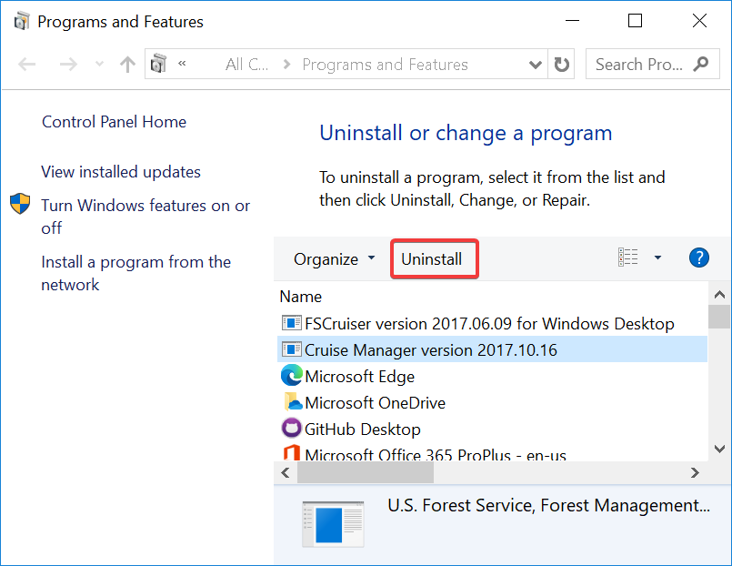

# Removing Old Version
In preperation for installing the application from the Software Center, on Forest Service computers. You will need to uninstall previous versions using Power Broker.

 Locate `PowerBroker - Uninstall or change a Program` in you start menu. 

 

Select the old version and click `Uninstall`

 